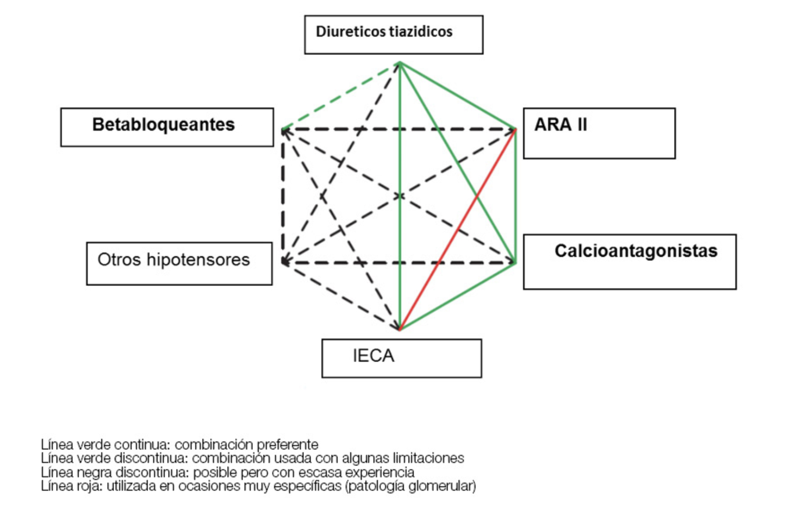

# Sistema de recomendación terapéutica aplicado en pacientes hipertensos del Hospital Universitario Infanta Leonor.

La HTA se define como una PAS ≥ 140 mmHg o una PA diastólica (PAD) ≥ 90 mmHg medidas en consulta. Es una enfermedad que afecta al 43% de la población adulta española. 
Basándonos en la PA medida en consulta, la prevalencia mundial de la HTA se ha estimado en 1.130 millones en 2015, con una prevalencia > 150 millones en Europa central y oriental.

Este gran impacto, unido a la complejidad del tratamiento fruto de la inmesidad cantidad de combinaciones y opciones terapéuticas posibles. Provoca que se deba acudir a guías con frecuencia y se abuse del ensaño y error, ajustando dosis y combinaciones en sucesivas consultas. Buscando la combinación exacta para cada paciente. Lo que alarga el periodo de descontrol de la presión arterial y encarece todo el proceso.

Por ello la idea de crear un sistema de recomendación guiado por el estudio minucioso de la patología y de sus respectivos tratamientos. Que nos permita realizar recomendaciones a los facultativos en base a pacientes previos con caracteristicas similares. 

Con tal fin, se creo una base de datos de 12.273 pacientes con un total de 260 variables analizadas (Obtenidos con la herramienta Savana). Y tras la correspondiente limpieza, se le aplico diversos sistemas de recomendación "Euclidio, Canberra y Chebyshev. 

Obteniendose pacientes muy parecidos cuando se calculaba la distancia entre ellos con los modelos Euclidio y Canberra, y bastante dispares con el último modelo.

Ejemplo modelo Euclidio:

Aviso: No se adjunta las base de datos, por motivos de confidencialidad.
